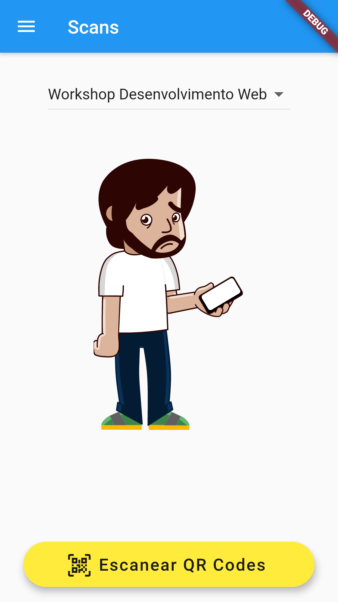

<!-- PROJECT SHIELDS -->
<!--
*** I'm using markdown "reference style" links for readability.
*** Reference links are enclosed in brackets [ ] instead of parentheses ( ).
*** See the bottom of this document for the declaration of the reference variables
*** for contributors-url, forks-url, etc. This is an optional, concise syntax you may use.
*** https://www.markdownguide.org/basic-syntax/#reference-style-links
-->

[![Contributors][contributors-shield]][contributors-url]
[![MIT License][license-shield]][license-url]
[![Issues][issues-shield]][issues-url]
[![Forks][forks-shield]][forks-url]
[![Stargazers][stars-shield]][stars-url]


<!-- PROJECT LOGO -->
<br />
<p align="center">
  <a href="https://github.com/caiopardal/mc853_mobile">
    
  </a>

  <h3 align="center">Inscritus</h3>

  <p align="center">
    Um aplicativo para ajudar na realização do seu evento!
    <br />
    <a href="https://github.com/caiopardal/mc853_mobile/blob/master/README.md"><strong>Explore a documentação do projeto »</strong></a>
    <br />
    <br />
    ·
    <a href="https://github.com/caiopardal/mc853_mobile/issues">Reporte um Bug</a>
    ·
    <a href="https://github.com/caiopardal/mc853_mobile/issues">Solicite uma Feature</a>
  </p>
</p>


<!-- TABLE OF CONTENTS -->
## Tabela de Conteúdos

* [Sobre o projeto](#sobre-o-projeto)
  * [Feito com](#feito-com)
* [Getting Started](#getting-started)
  * [Pré-requisitos](#pré-requisitos)
  * [Configurações](#configurações)
* [Uso](#uso)
* [Contribuições](#contribuições)
* [Licença](#licença)
* [Contato](#contato)


<!-- ABOUT THE PROJECT -->
## Sobre o projeto

[Inscritus](assets/logo.png)

O aplicativo Inscritus é um projeto feito para facilitar a organização e visualização de seus eventos por parte de seus usários. Nele seus usuários poderão criar suas próprias contas, acessarem a programação do seu evento, favoritar atividades, encontrarem mais informações sobre o evento e muito mais. Já para a organização do evento, ele conta com scanner de QR Codes e funções personalizadas para auxiliar no gerenciamento das presenças e inscrições dos seus participantes.

### Feito com

O aplicativo foi desenvolvido utilizando a linguagem de programação Dart em conjunto com a tecnologia para construir aplicações mobile e web feita pelo Google, Flutter. Além disso, conta com o uso do Firebase como banco de dados e API principal. 
* [Dart](https://dart.dev/)
* [Flutter](https://flutter.dev/)
* [Firebase](https://firebase.google.com/?hl=pt-br&gclid=EAIaIQobChMIzZWJ04fw6gIVChKRCh0UewF-EAAYASAAEgK-o_D_BwE)


<!-- GETTING STARTED -->
## Getting Started

Para começar a usar e modificar a aplicação no seu dispositivo local, você precisará seguir algumas instruções abaixo:

### Pré-requisitos

Será necessário instalar o Flutter inicialmente. Para instalar o Flutter na sua máquina e começar a codar, siga o tutorial da documentação oficial (https://flutter.dev/docs/get-started/install), isso pode demorar algum tempo, pois existem diversas particularidades de cada sistema operacional.
This is an example of how to list things you need to use the software and how to install them.

Bom, após feito isso, configure seu editor de preferência para podermos começar a codar nosso primeiro projeto. No meu caso, gosto bastante do Visual Studio Code (https://code.visualstudio.com/), pois além de ser um editor leve e prático, ainda conta com diversas extensões que podemos utilizar para diversas linguagens. Caso esteja utilizando ele também, recomendo que instale a extensão do Dart (https://marketplace.visualstudio.com/items?itemName=Dart-Code.dart-code) e a do Flutter (https://marketplace.visualstudio.com/items?itemName=Dart-Code.flutter).

Agora sim podemos iniciar o projeto. Abra um terminal e rode o seguinte comando no diretório desejado:

```sh
cd mc853_mobile
```

Agora, caso possua um simulador Android ou iOS configurado na sua máquina, rode o comando:

```sh
flutter run
```

Se não possuir, você pode conectar o seu dispositivo físico no seu computador com a depuração por usb ativada nas opções de desenvolvedor e fazer o mesmo processo. (É possível realizar isso de dentro do VSCode também, basta clicar em run na barra superior e depois em start debugging).

### Configurações

Para rodar o projeto corretamente, precisará criar um novo projeto no Firebase e realizar as configurações necessárias para o sistema operacional do seu celular (Android ou iOS). Para isso, siga as instruções da própria documentação do Firebase:

- [Android](https://firebase.google.com/docs/flutter/setup?hl=pt#configure_an_android_app)
- [iOS](https://firebase.google.com/docs/flutter/setup?hl=pt#configure_an_ios_app)

Feito isso, basta criar as coleções do Banco de dados com todas as informações presentes nos modelos criados no projeto. Estes se encontram na pasta *lib/models/*

- Guia com os nomes das coleções

| Collection Name | Model |
| --------------- | ----- |
|users|user|
|activities|activity|
|speaker|speaker|
|activity-types|activity_type|
|locations|location|
|feed|announcement|

Além dessas, você precisará criar algumas coleções dentro de algumas dessas principais

| First Collection | SubCollection | Fields |
| ---------------- | ------------- | ------ |
|users|favorites|activity: string / createdAt: Timestamp|
|users|registrations|activity: string / registeredAt: Timestamp / registeredBy: Timestamp|
|users|attendances|activity: string / registeredAt: Timestamp / registeredBy: Timestamp|
|activities|attendants|user: string / registeredAt: Timestamp / registeredBy: Timestamp|
|activities|registrations|user: string / registeredAt: Timestamp / registeredBy: Timestamp|

<!-- USAGE EXAMPLES -->
## Uso

Explicando um pouco mais de cada tela e casos de uso, temos:

- Login

Nessa tela, os usuários que já possuem conta, podem entrar no app usando seu e-mail e senha.

<p></p>

- Registro

Nessa tela, os usuários podem preencher seus dados e realizar um cadastro.

<p></p>

- Menu lateral: 

Nele estão presentes todas as telas e navegações possíveis do app.

*Usuário comum*: Início, Sobre nós, Minhas atividades, Mapa do evento e Fazer logout.
<p></p>

*Usuário com privilégios de administrador*: Início, Sobre nós, Scans, Minhas atividades, Mapa do evento e Fazer logout.

<p></p>

- Tela de início:

Nela constam duas tabs principais: Mural de notícias, onde os usuários podem checar avisos sobre o evento e outras informações pertinentes e Atividades, onde os usuários possuem acesso a todas as atividades presentes no cronograma do evento. Além disso, caso você seja um usuário sem permissões de administrador, você também terá acesso a um botão que te leva ao seu QR Code de inscrição do evento.

<p></p>
<p></p>
<p></p>
<p></p>

- Sobre nós

Nela constam todas as informações sobre o evento: Descrição, Local, Organizadores, Informações adicionais e patrocinadores.

<p></p>

- Minhas atividades

Nela constam todas as atividades que foram favoritadas por um usuário.

<p></p>

- Scans

Nessa tela, os administradores, poderão escolher a atividade que desejam realizar as inscrições e, após isso, ler os QR Codes de cada participante.

<p></p>
<p></p>
<p></p>
<p></p>
<p></p>
<p></p>
<p></p>

- Palestrantes

Nessa tela, estão todos os palestrantes confirmados do evento, contendo suas informações e redes sociais

<p></p>

- Mapa

Aqui, os usuários podem analisar um mapa completo do evento, podendo ampliar a imagem, caso necessário.

<p></p>

- Fazer logout

Ao clicar nesse botão, o usuário é deslogado do aplicativo e sua sessão encerrada.


<!-- CONTRIBUTING -->
## Contribuições

Contribuições são o que tornam a comunidade open-source um lugar incrível para aprender, inspirar e criar. Todas as contribuições que você fizer serão **muito apreciadas**.

1. Clone o projeto na sua máquina
2. Crie sua branch de feature (`git checkout -b feature/AmazingFeature`)
3. Commite suas mudanças (`git commit -m 'Add some AmazingFeature'`)
4. Faça o push das mudanças na branch remota (`git push origin feature/AmazingFeature`)
5. Abra um Pull Request
6. Espere por um review e merge :)


<!-- LICENSE -->
## Licença

Distribuído dentro da licença MIT. Veja `LICENSE` para mais informações.

<!-- CONTACT -->
## Contato

Caio Pardal - [caiopardal](https://github.com/caiopardal) - pardal.henrique@gmail.com

Project Link: [https://github.com/caiopardal/mc853_mobile](https://github.com/caiopardal/mc853_mobile)

<!-- MARKDOWN LINKS & IMAGES -->
<!-- https://www.markdownguide.org/basic-syntax/#reference-style-links -->
[contributors-shield]: https://img.shields.io/github/contributors/scottydocs/README-template.md
[contributors-url]: https://github.com/caiopardal/mc853_mobile/contributors
[forks-shield]: https://img.shields.io/github/forks/scottydocs/README-template.md?style=social
[forks-url]: https://github.com/caiopardal/mc853_mobile/network/members
[stars-shield]: https://img.shields.io/github/stars/scottydocs/README-template.md?style=social
[stars-url]: https://github.com/caiopardal/mc853_mobile/stargazers
[issues-shield]: https://img.shields.io/github/issues/othneildrew/Best-README-Template.svg?style=flat-square
[issues-url]: https://github.com/caiopardal/mc853_mobile/issues
[license-shield]: https://img.shields.io/github/license/othneildrew/Best-README-Template.svg?style=flat-square
[license-url]: https://github.com/caiopardal/mc853_mobile/blob/master/LICENSE.txt
[product-screenshot]: images/logo.png
